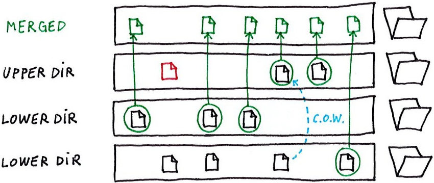
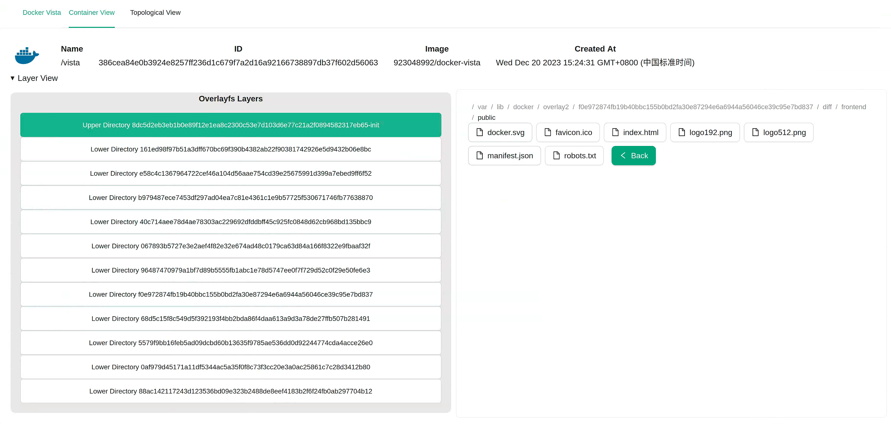
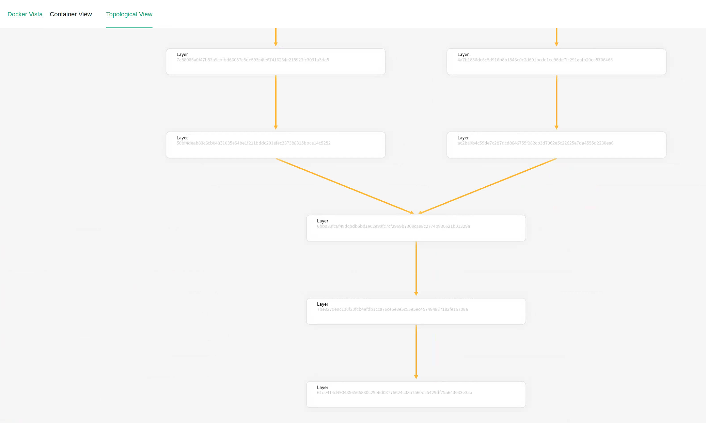

# Docker Vista

Docker container is based on Overlayfs, which is consisted of one upper directory and many lower directories. It is useful to understand and analyze its structure.


**For linux only.**

# The Visualization Results
+ View the overlayfs structure and browse the file system
    
+ View the topography(mysql:8.0 and mysql:latest have overlapped layers)
    
# How To Run It

```shell
sudo docker run -itd -p 3000:3000 -v /var/run/docker.sock:/var/run/docker.sock -v /var/lib/docker/overlay2:/var/lib/docker/overlay2 --name vista 923048992/docker-vista
```

Then start the browser at http://localhost:3000.